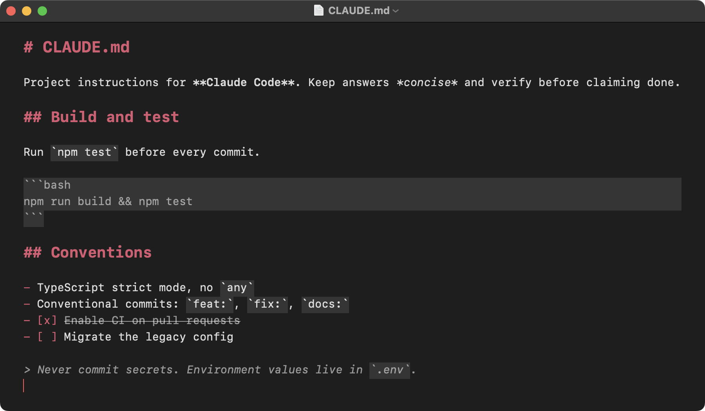
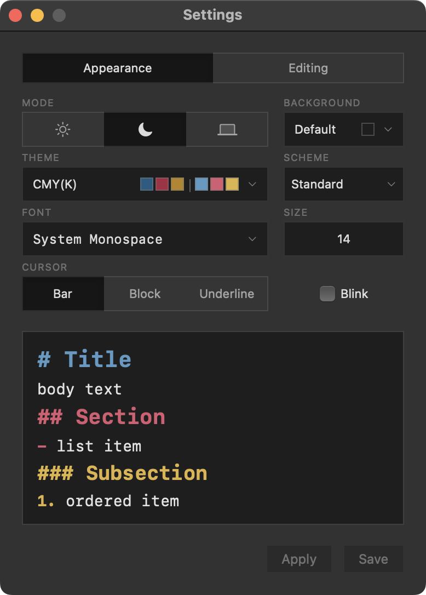
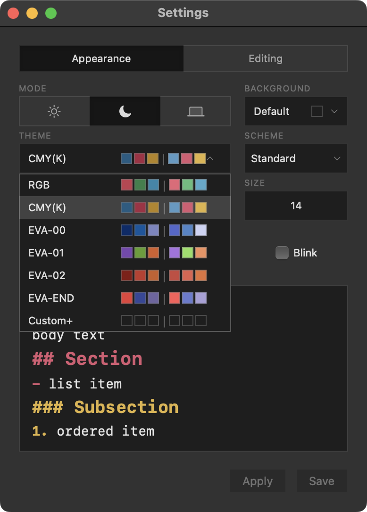
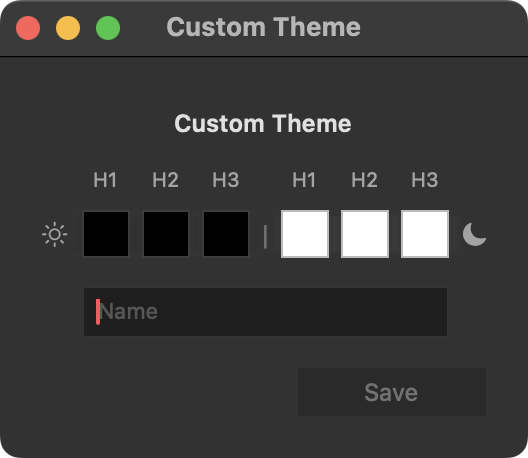

# MacMD

A fast, native Markdown editor for macOS with live syntax highlighting, a rendered preview, and Mermaid diagrams. Free and open source, MIT licensed, and a download smaller than 3 MB with zero telemetry.

Built for the Markdown files developers actually live in: `README.md`, `CLAUDE.md`, `AGENTS.md`, agent and skill configs, notes, and docs.

**[Download the latest release](../../releases/latest)** (macOS 14 or later)

## Live preview

View → Show Preview (Cmd-Shift-P) splits the window with a rendered view that updates as you type and follows the editor as you scroll. It renders tables, strikethrough, and autolinked URLs, mirrors your editor theme, fonts, and background in light and dark, loads images from the document's folder, and opens links in your browser.

Documents open editor-only. Like the formatting toggle, Show Preview applies to every open window at once.

## Mermaid diagrams

Fenced `mermaid` code blocks render as real diagrams in the preview and in exports, as in the screenshot above. Twelve diagram types ship: flowchart, sequence, class, state, entity relationship, gantt, pie, mindmap, git graph, journey, timeline, and quadrant. Rendering happens locally in a locked-down sandbox: document content cannot run script, and nothing touches the network.

## Export to HTML

File → Export to HTML (Cmd-Shift-E) writes a single self-contained file. Styling is inlined and matches your theme, images from the document folder are embedded, and Mermaid diagrams are baked in as SVG. Remote image references are stripped, so the exported file loads nothing from the network when someone opens it.

## The editor

Everything stays plain text; the editor styles it live and never rewrites it:

- Headings, bold, italic, strikethrough, inline code, fenced code blocks (backtick and tilde), links, ordered and unordered lists, blockquotes, horizontal rules, and YAML/TOML front matter
- Task lists with clickable checkboxes (or Cmd-Shift-L on the current line)
- Return continues lists and keeps ordered-list numbering going
- Cmd-/ flips every window between styled Markdown and plain source with line numbers
- Find and Replace, Print, spell check with optional grammar, and an optional word count with reading time
- Format commands that wrap or unwrap the selection: bold (Cmd-B), italic (Cmd-I), strikethrough (Cmd-Shift-X), inline code, link (Cmd-K)

## Themes

  
  

Settings (Cmd-,) covers Light, Dark, or System mode, the editor background (any custom color, with text that adjusts to stay readable), the body font (eight families) and size, and the cursor style (bar, block, or underline, blink optional), all with a live preview in the window.

Heading color is a scheme choice: Default (no color), Unified (one color for every level, eight presets), or Standard (three colors for H1/H2/H3, six preset palettes). The hero screenshot above is Standard with the CMY(K) palette.

Custom+ opens the theme builder: pick your own colors, separately for light and dark, name the palette, and it saves into the theme list.

## Plain text you can trust

What you save is what you typed: UTF-8, no smart quotes, no dash substitution, no autocorrect, and paste always comes in plain. The two exceptions are old text-editor conventions, a single trailing newline added on save if missing and a leading BOM stripped on read. A file that is not valid UTF-8 is refused with an error instead of silently corrupted. Files over 8 MiB open unstyled so typing stays fast; over 64 MiB they are refused.

## Privacy and security

MacMD makes no network connections: no update checks, no crash reporting, no analytics. The preview and export render fully offline from a bundled engine, inside a web view with a strict content security policy, all network access denied, and no script execution from document content. The binary is code-signed with the hardened runtime enabled.

The app is not sandboxed (the App Sandbox broke saving to external drives; BBEdit, Sublime Text, and VS Code make the same call). It only touches files you open or save through the standard panels. Verify the entitlements yourself:

    codesign -dv --entitlements - /Applications/MacMD.app

Security reports: see [SECURITY.md](SECURITY.md).

## Install

Grab the DMG from the [latest release](../../releases/latest) and drag MacMD to Applications. It is signed but not notarized, so approve it once on first launch: on macOS 15 or newer, System Settings → Privacy & Security → Open Anyway; on macOS 14, right-click the app → Open.

MacMD opens `.md`, `.markdown`, `.mdown`, and `.mkd`. Uninstalling is dragging it to the Trash; the only leftover is a small preferences file in `~/Library/Preferences`.

## Building

Requires Xcode 16 or newer. Open `MacMD.xcodeproj` and hit Cmd-R, or:

    xcodebuild -project MacMD.xcodeproj -scheme MacMD -configuration Release -destination 'platform=macOS' build

Run the tests the same way with `xcodebuild test`. The suite (352 tests) pins every highlighting rule, the file-handling guarantees, the render pipeline, and a hostile-input security gate. Project layout and house rules are in [CONTRIBUTING.md](CONTRIBUTING.md).

## Roadmap

A formatting toolbar, an outline pane, and a file browser are in development for 2.1. Multi-cursor editing is not planned.

## License

MIT. See [LICENSE](LICENSE). Built by [sleetcrash](https://github.com/sleetcrash).
