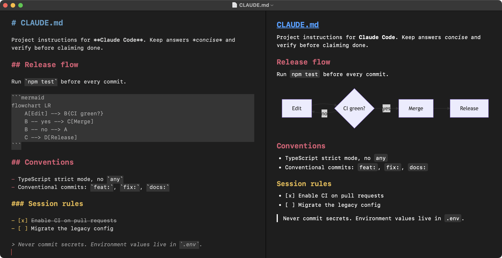

# MacMD

A simple, clean, secure markdown editor for macOS. Feels like TextEdit, but for `.md` files and with live syntax highlighting.

Built for editing agent.md/claude.md, skill definitions, agent configs, READMEs, and similar small-to-medium markdown files.



## Install

Minimum macOS version: 14 (Sonoma).

### 1. Download

Go to the [latest release](../../releases/latest). You'll see several files; grab just one (version numbers will match whatever the current release is):

| File | What it is | Who should click it |
|---|---|---|
| **`MacMD-<version>.dmg`** | The installer. ~400 KB. | **Most people: this is the one you want.** |
| `MacMD-<version>.zip` | Same app, zipped instead of in a DMG. | Alternative if your browser doesn't like DMGs. |
| `*.sha256` | Tiny checksum files. | Optional; for verifying your download wasn't tampered with. |
| `Source code (zip / tar.gz)` | The Swift source. | Only if you want to build it yourself. Ignore otherwise. |

### 2. Copy to Applications

Double-click the DMG. A Finder window opens with `MacMD.app` and an `Applications` shortcut. Drag `MacMD.app` onto `Applications`. You can eject the DMG after.

### 3. First launch (one-time Gatekeeper approval)

MacMD is signed ad-hoc, not Apple-notarized (notarization requires a paid Apple Developer account), so macOS blocks it the first time.

**On macOS 15 Sequoia or newer:**

1. Double-click `MacMD` in Applications.
2. macOS shows "cannot verify this app is free from malware." Click **Done**.
3. Open **System Settings → Privacy & Security**. Scroll to the **Security** section.
4. Next to "MacMD was blocked to protect your Mac", click **Open Anyway**.
5. Confirm once more, authenticate with Touch ID or password.
6. MacMD launches.

**On macOS 14 Sonoma:**

Right-click `MacMD.app` → **Open** → **Open** in the confirmation dialog.

After this one-time approval, MacMD launches normally every time.

### 4. Open .md files

Any of these work:

- Double-click any `.md` file and choose **Open With → MacMD** (or set it as default via File → Get Info → Open with → Change All).
- Drag a `.md` file onto the MacMD icon in the Dock.
- File → Open inside MacMD.
- Cmd-N for a new untitled document.

### Uninstall

Drag `MacMD.app` from Applications to Trash. No daemons, no receipts, no leftover prefs.

## Write and save

File menu works exactly as you'd expect. All commands use standard Mac keybindings.

    Cmd-N     New document
    Cmd-O     Open an existing .md file
    Cmd-S     Save (prompts for filename + location on first save)
    Cmd-Shift-S   Save As
    Cmd-W     Close window (prompts to save if dirty)
    Cmd-Z / Cmd-Shift-Z   Undo / Redo
    Cmd-F     Find (inline find bar)
    Cmd-Shift-L   Toggle the task checkbox on the current line
    Cmd-+ / Cmd--   Increase / decrease editor font size
    Cmd-0     Reset editor font size to the default
    Cmd-,     Settings (currently just the editor font size)

The editor autosaves in the background. If the app quits unexpectedly, reopening recovers your work. Recent files appear under `File → Open Recent`.

## What gets highlighted

As you type, MacMD styles these markdown constructs live:

    # Heading 1 through ###### Heading 6   → bold, theme color, sized per level
    **bold** and __bold__                  → bold
    *italic* and _italic_                  → italic
    ***bold italic***                      → bold + italic compose correctly
    ~~strikethrough~~                      → single-line strike
    `inline code`                          → subtle background tint
    ```        ~~~                         → fenced code blocks get the same tint,
    fenced     fenced                         and style to end of document if you
    ```        ~~~                            haven't closed them yet (backtick and
                                              tilde fences both work; a fence can
                                              only be closed by the same marker)
    [link label](https://example.com)      → label underlined in link color, URL muted
    - unordered, * and + also valid        → marker inherits its section's heading color
    1. ordered list, 1) also valid         → marker inherits its section's heading color
    - [ ] todo                             → bracket inherits section color; click to toggle
    - [x] done                             → bracket inherits section color + body strike-through
    > blockquote                           → muted + italic, composes with bold inside
    ---                                    → muted

Highlighting updates only the paragraph you're editing, so typing stays smooth on long files. Inside fenced code blocks, inline rules are intentionally suppressed, so code stays code.

Semantic colors are used throughout, so Dark Mode adapts automatically when you toggle system appearance.

## What gets saved

Plain UTF-8 text. Byte-for-byte what you typed: no smart quotes, no dash substitution, no link detection, no autocorrect. Paste from another app always comes in as plain text.

Two narrow exceptions to byte fidelity, in line with what BBEdit, Sublime, and VS Code do:

- A single trailing newline is appended on save when the document doesn't already end with one (POSIX text-file convention; matters for shell pipelines, `wc -l`, and `git diff`).
- A leading UTF-8 BOM (`EF BB BF`) is stripped on read, since BOMs are how some Windows editors and web tools sign their UTF-8 output and most editors silent-strip on import.

If you try to open a file that isn't valid UTF-8, MacMD refuses and surfaces a clear error rather than silently corrupting it with replacement characters.

Files larger than 64 MiB are rejected outright with a standard document-open error. Files between 8 MiB and 64 MiB open with syntax highlighting disabled so typing stays responsive; they're still fully editable, just unstyled.

## Security

MacMD has no network access, no access to the camera, microphone, location, photos, contacts, calendars, or Spotlight indexing. It doesn't register any URL schemes, daemons, or background services. The hardened runtime is enabled and the binary is code-signed.

The app only ever opens and saves files you explicitly choose through the standard Open and Save panels; it doesn't browse your filesystem on its own.

As of 1.0.2 MacMD is **not sandboxed**. The App Sandbox was removed because it caused intermittent save failures on external / USB volumes (the security-scoped URL granted at file-open time stopped being valid after the drive slept or was re-mounted, which is a known limitation of SwiftUI's `DocumentGroup`). This matches the posture of editors like BBEdit, Sublime Text, and VS Code.

You can verify at any time:

    codesign -dv --entitlements - /path/to/MacMD.app

## Build from source

Requires Xcode 16 or newer.

    xcodebuild -project MacMD.xcodeproj -scheme MacMD -configuration Release -destination 'platform=macOS' build

The built app lands in Xcode's DerivedData under `Build/Products/Release/MacMD.app`, or you can open the project in Xcode and press Cmd-R to run it directly.

Run tests:

    xcodebuild test -project MacMD.xcodeproj -scheme MacMD -destination 'platform=macOS'

The test suite (54 tests as of 1.1.1) covers every syntax highlighting rule and the tricky edge cases: bold+italic composition, unclosed and newly-added/removed code fences, tilde-vs-backtick fence pairing, list-marker vs italic disambiguation, paragraph-style preservation, document size guard, BOM stripping, trailing-newline policy, the task-list toggle (click and keyboard), editor font-size bounds, and a guard against pathological emphasis lines.

### Produce a release bundle

    Scripts/package.sh X.Y.Z

This runs a clean Release build and produces four artifacts in `dist/`:

    MacMD-X.Y.Z.zip           signature-preserving zip (built with ditto)
    MacMD-X.Y.Z.zip.sha256
    MacMD-X.Y.Z.dmg           drag-to-Applications installer
    MacMD-X.Y.Z.dmg.sha256

Upload all four to the GitHub release page. Most users prefer the DMG; the zip is a smaller alternative.

## Project layout

    MacMD/
      README.md                   This file
      LICENSE                     MIT
      CHANGELOG.md                Version history
      .gitignore
      MacMD.xcodeproj/            Xcode project
      MacMD/                      Source
        MacMDApp.swift            Entry point; @main; DocumentGroup
        MarkdownDocument.swift    FileDocument; UTF-8 read/write
        DocumentView.swift        Thin SwiftUI wrapper around the text view
        MarkdownTextView.swift    NSViewRepresentable wrapping NSTextView
        MarkdownHighlighter.swift NSTextStorageDelegate; regex rules
        Theme.swift               Fonts, colors, paragraph style
        Info.plist                Document types, UTI declarations
        MacMD.entitlements        Empty (sandbox removed in 1.0.2)
        Assets.xcassets/          AppIcon + AccentColor
      MacMDTests/
        MarkdownHighlighterTests.swift
        MarkdownDocumentTests.swift
        TaskListInteractionTests.swift
      Scripts/
        README.md
        make_icon.swift           Regenerates the app icon PNGs
        make_social_preview.swift Regenerates the GitHub social preview card
        package.sh                Builds Release and produces zip + dmg in dist/
      docs/
        screenshot.png
        social-preview.png
      dist/                       (gitignored) release artifacts go here

## Theming

Open Settings (Cmd-,) to color your headings:

- **Mode**: Light, Dark, or System (follows macOS).
- **Scheme**: Default (no color, the out-of-box default), Unified (one color for every heading level), or Standard (three colors: H1, H2, H3, with H4–H6 inheriting H3).
- **Theme**: preset palettes (RGB, CMY(K), and four EVA palettes for Standard; eight single colors for Unified), or a custom palette you name and save. Each color is tuned for both light and dark.
- **Size**: the editor font size (also on the View menu: Cmd-+, Cmd--, Cmd-0).

List markers inherit the color of the heading section they sit under. Body text always uses the adaptive label color. With the Default scheme, headings are bold and sized but not colored.

## Known intentional limits

No live rendered preview pane. No toolbar. No word count, export to HTML, or front-matter handling. The goal is "simple like TextEdit, but for markdown"; anything beyond that is out of scope.

No multi-cursor editing (NSTextView supports it; MacMD preserves only the primary selection through external text updates). No outline pane, no file browser.
