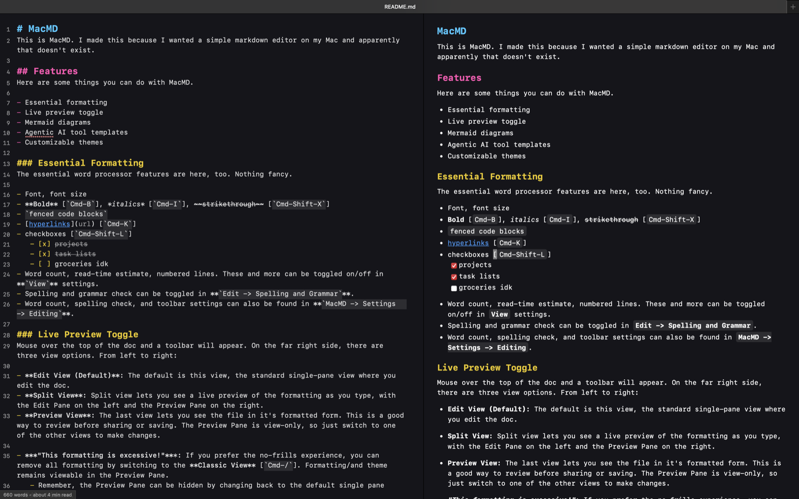
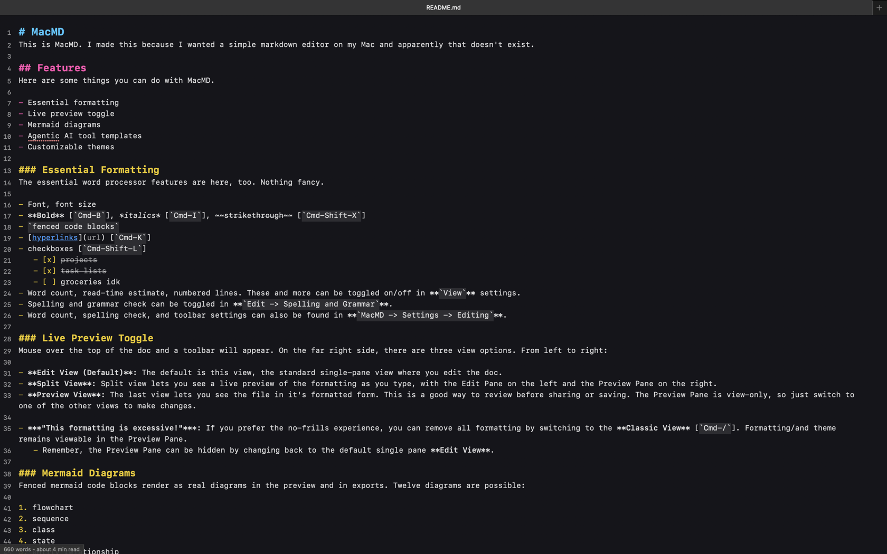
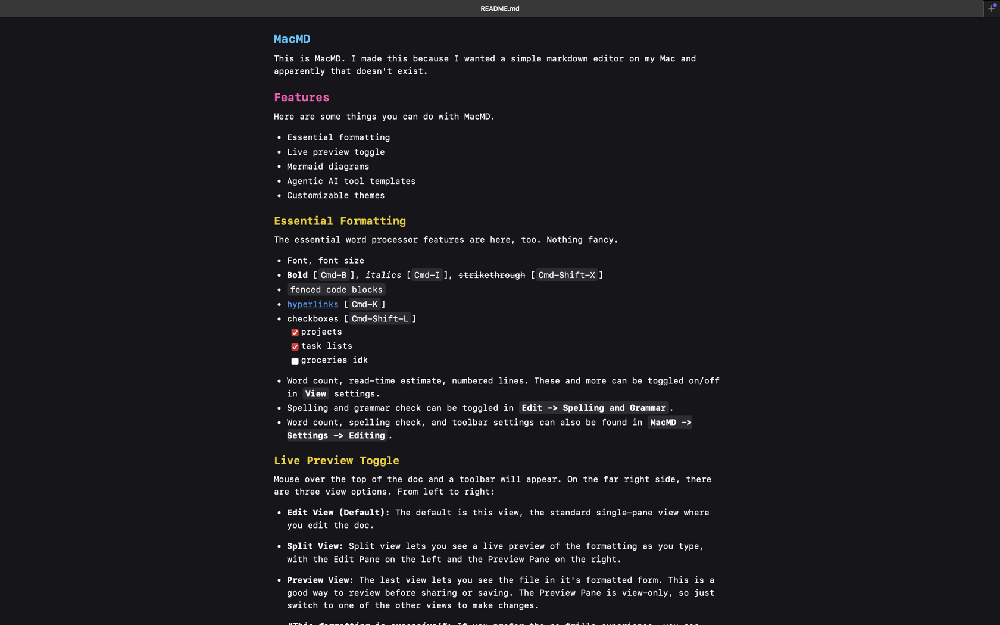
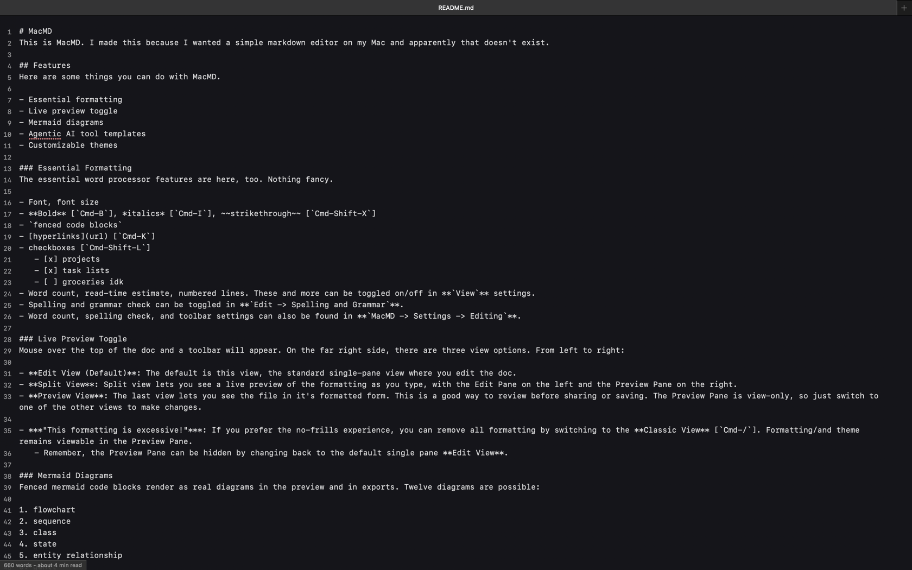
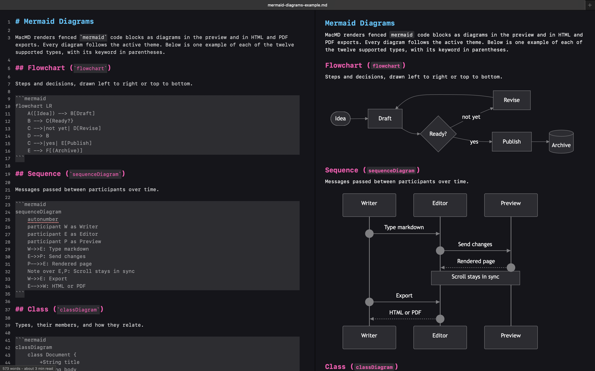
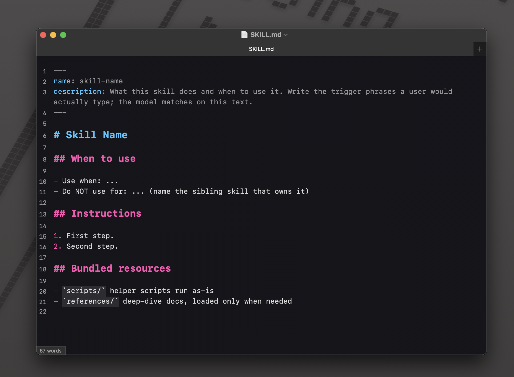
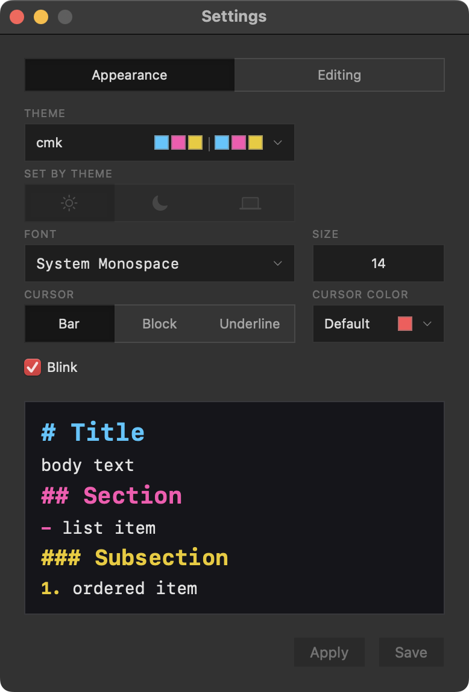
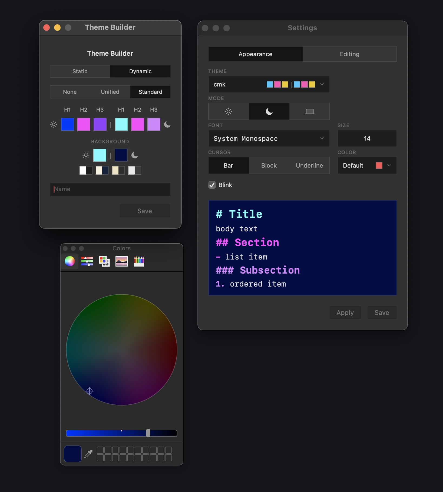

# MacMD
This is MacMD. I made this because I wanted a simple Markdown editor on my Mac and apparently that doesn't exist.

**[Download the latest release](../../releases/latest)** (macOS 14 or later)



## Features
Here are some things you can do with MacMD.

- Essential formatting
- Live preview toggle
- Mermaid diagrams
- Agentic AI tool templates
- Customizable themes

### Essential Formatting
The essential word processor features are here, too. Nothing fancy.

- Font, font size
- **Bold** [`Cmd-B`], *italics* [`Cmd-I`], ~~strikethrough~~ [`Cmd-Shift-X`]
- `inline code` and fenced code blocks
- [Hyperlinks](https://github.com/sleetcrash/MacMD) [`Cmd-K`]
- Checkboxes [`Cmd-Shift-L`]
	- [x] projects
	- [x] task lists
	- [ ] groceries idk
- Word count, read-time estimate, numbered lines. These and more can be toggled on/off in the **`View`** menu.
- Spelling and grammar check can be toggled in **`Edit → Spelling and Grammar`**.
- Word count, spelling check, and toolbar settings can also be found in **`MacMD → Settings → Editing`**.

### Live Preview Toggle
Mouse over the top of the doc and a toolbar will appear. On the far right side, there are three view options. From left to right:

- **Edit View (Default)**: The default is this view, the standard single-pane view where you edit the doc.
- **Split View**: Split View lets you see a live preview of the formatting as you type, with the Edit Pane on the left and the Preview Pane on the right.
- **Preview View**: The last view lets you see the file in its formatted form. This is a good way to review before sharing or saving. The Preview Pane is view-only (except checkboxes, which you can tick right there), so just switch to one of the other views to make changes.

- ***"This formatting is excessive!"***: If you prefer the no-frills experience, you can remove all formatting by switching to the **Classic View**: turn off **`View → Show Formatting`** [`Cmd-/`]. Formatting and theme remain viewable in the Preview Pane.
	- Remember, the Preview Pane can be hidden by changing back to the default single-pane **Edit View**.

<p>
  
  
  
</p>

### Mermaid Diagrams
Fenced Mermaid code blocks render as real diagrams in the preview and in exports. Twelve diagram types are possible:

1. flowchart
2. sequence
3. class
4. state
5. entity relationship
6. Gantt
7. pie
8. mindmap
9. git graph
10. journey
11. timeline
12. quadrant

See [mermaid-diagrams-example.md](docs/mermaid-diagrams-example.md) for examples of each.



### Agentic AI Tool Templates
Built-in templates for your AI/agentic tools, including SKILL.md, agent-name.md, CLAUDE.md, and AGENTS.md, can be found in **`File → New from Template`**.

These are ready for you or your AI of choice to edit and build from. SKILL.md and agent-name.md come with the YAML front matter Claude Code reads to decide when to use them.



### Customizable Themes
Customize MacMD to your liking with pre-built and customizable themes that go beyond light and dark mode. Customization lives in **`MacMD → Settings → Appearance`** or [`Cmd-,`].

- Change the colors of your headings with a selection of pre-built themes (personally created by me).
- Create your personalized experience by choosing colors you prefer. Compatible with the dynamic light/dark mode automatic settings.
- Background color and cursor can also be customized to your liking for a fully unique setup.

Is this level of customization necessary? Yes. If you said "no," you can choose from the basic themes, keep the default, or toggle to the Classic View.

<p>
  
  
</p>

## Exporting & Saving

**Export to HTML and PDF**

**`File → Export to HTML`** [`Cmd-Shift-E`]: Export the formatted preview as an HTML file, including all embedded diagrams and other elements.

**`File → Export to PDF`**: Export the formatted preview as a single-page PDF.

**`File → Save`** [`Cmd-S`]: Save your `.md` file as plain Markdown. The preview is rebuilt from that text, so there is nothing extra to save. Want a copy? Hold [`Option`] with the **`File`** menu open and **`Duplicate`** becomes **`Save As`**.

## Privacy

MacMD is fully offline. It makes no network connections: no update checks, no crash reporting, no analytics. The preview and export render fully offline from a bundled engine, inside a web view with a strict content security policy, all network access denied, and no script execution from document content. The binary is code-signed with the hardened runtime enabled.

The app is not sandboxed. It only touches files you open or save through the standard panels. Verify the entitlements:

```sh
codesign -dv --entitlements - /Applications/MacMD.app
```

**Security Reports**: See [SECURITY.md](SECURITY.md).

## Install

Grab the DMG from the [latest release](../../releases/latest) and drag MacMD to Applications. It is signed but not notarized, so approve it once on first launch: on macOS 15 or later, **`System Settings → Privacy & Security → Open Anyway`**; on macOS 14, right-click the app and choose **`Open`**.

MacMD opens `.md`, `.markdown`, `.mdown`, and `.mkd`. To uninstall, drag it to the Trash. It leaves behind only its preferences file and small WebKit and cache folders under `~/Library`.

## Building

Requires Xcode 16 or later. Open `MacMD.xcodeproj` and hit [`Cmd-R`], or:

```sh
xcodebuild -project MacMD.xcodeproj -scheme MacMD -configuration Release -destination 'platform=macOS' build
```

Run the tests the same way with `xcodebuild test`. Project layout and house rules are in [CONTRIBUTING.md](CONTRIBUTING.md).

## For AI Agents

The repo ships a ready-to-use skill at [`skills/macmd/SKILL.md`](skills/macmd/SKILL.md): the app's capability map, every `defaults` configuration key, and the full menu map, so an agent can open, configure, and verify MacMD on its own. Copy the `macmd` folder into `~/.claude/skills/` (or your agent's skill directory).

## License

MIT. See [LICENSE](LICENSE). Built by [sleetcrash](https://github.com/sleetcrash).
