# Mermaid Diagrams

MacMD renders fenced `mermaid` code blocks as diagrams in the preview and in HTML and PDF exports. Every diagram follows the active theme. Below is one example of each of the twelve supported types, with its keyword in parentheses.

## Flowchart (`flowchart`)

Steps and decisions, drawn left to right or top to bottom.

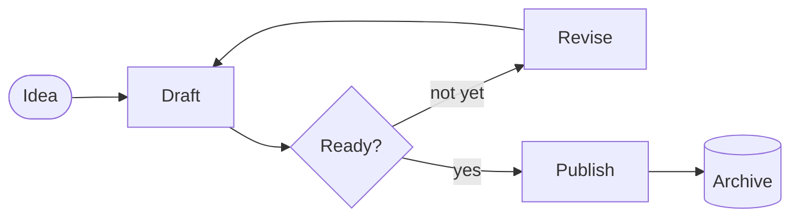

## Sequence (`sequenceDiagram`)

Messages passed between participants over time.

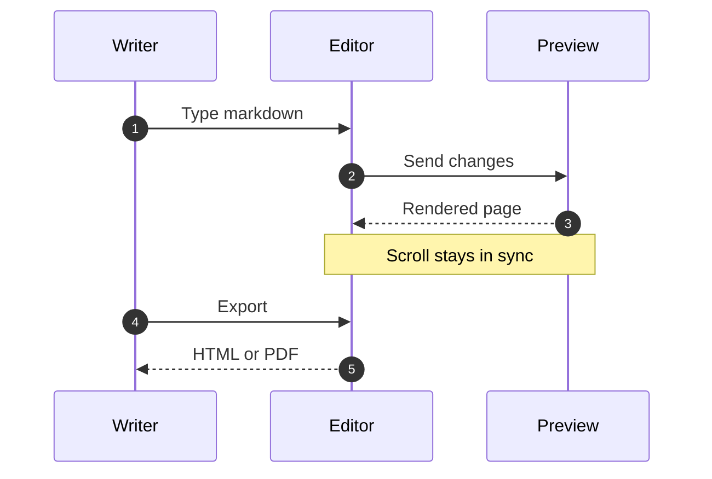

## Class (`classDiagram`)

Types, their members, and how they relate.

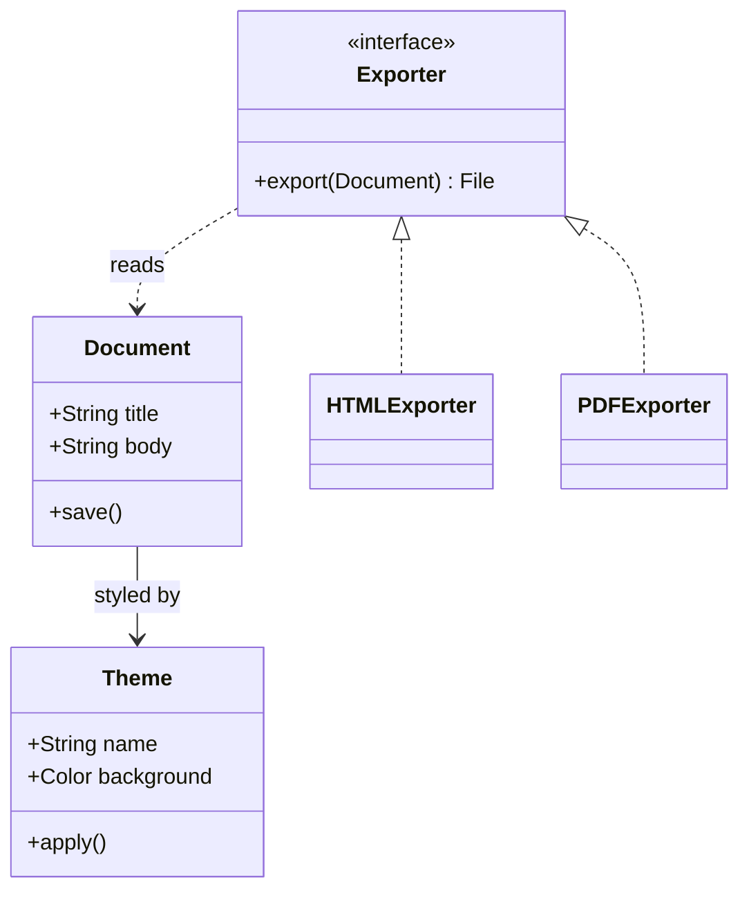

## State (`stateDiagram-v2`)

The states something moves through and what moves it.

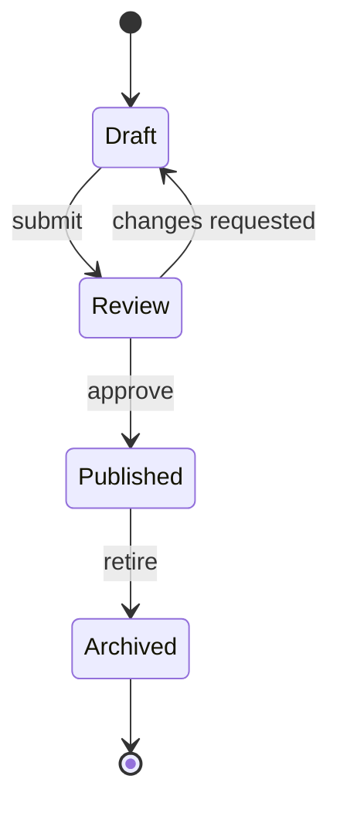

## Entity Relationship (`erDiagram`)

Records, their fields, and how many of one connect to another.

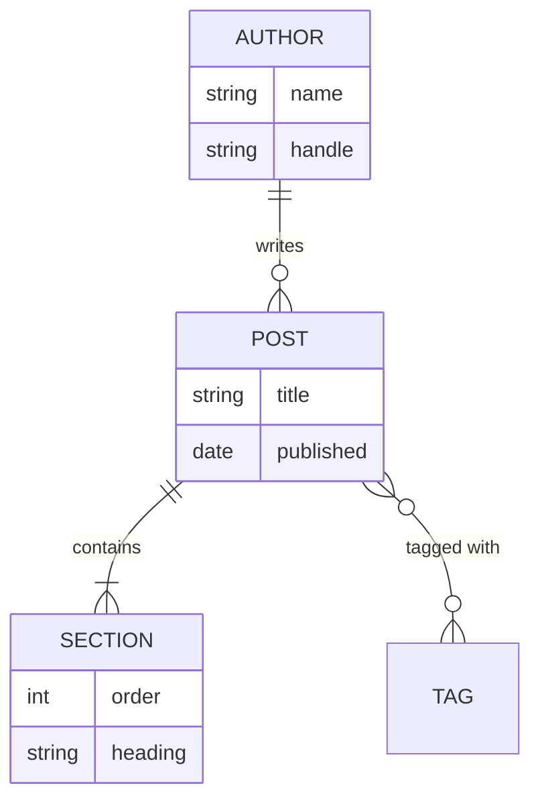

## Gantt (`gantt`)

Tasks on a calendar, with dependencies and milestones.

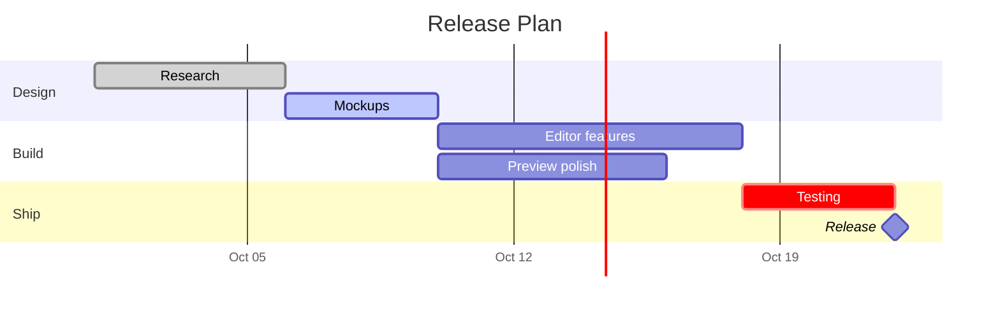

## Pie (`pie`)

Parts of a whole. Slices take their colors from the theme.

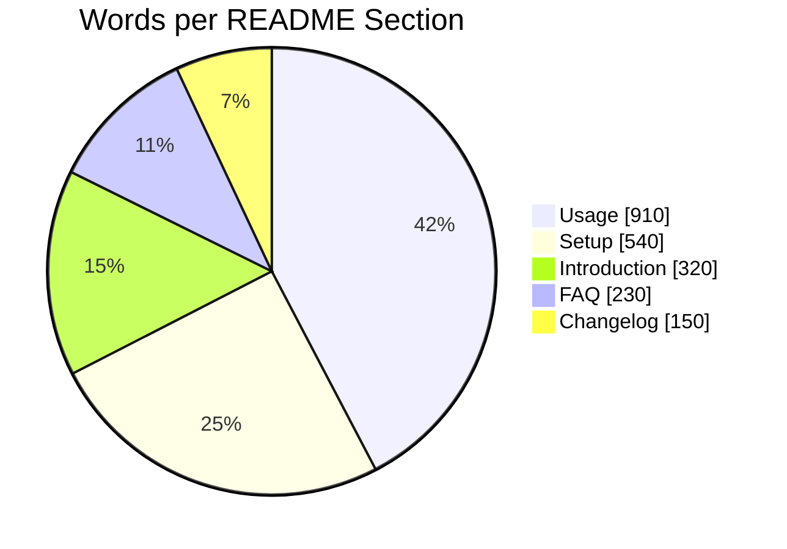

## Mindmap (`mindmap`)

Ideas branching out from one center.

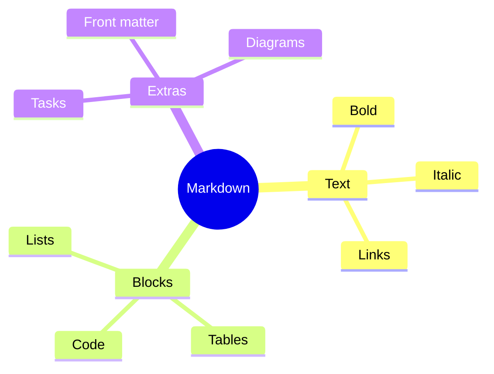

## Git Graph (`gitGraph`)

Commits, branches, merges, and tags.

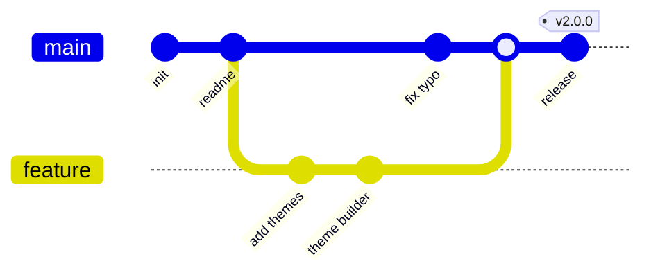

## Journey (`journey`)

How a task feels step by step, scored 1 to 5.

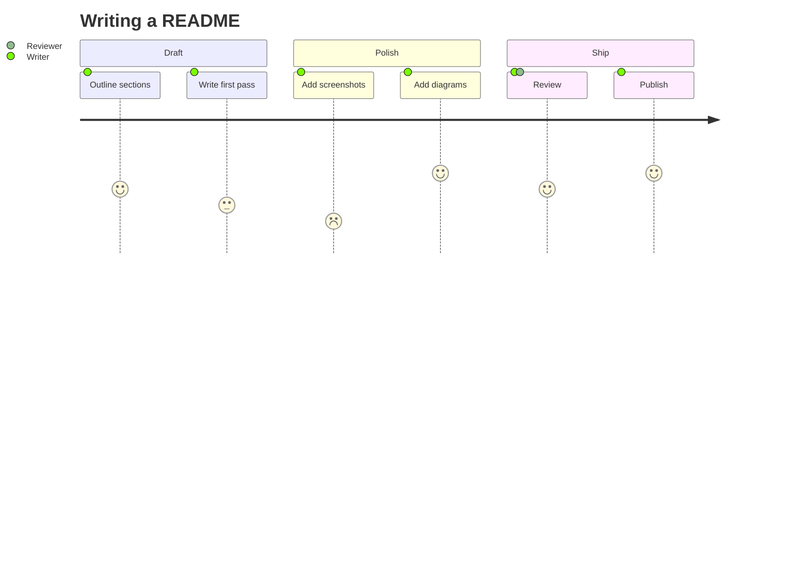

## Timeline (`timeline`)

Events grouped by period.

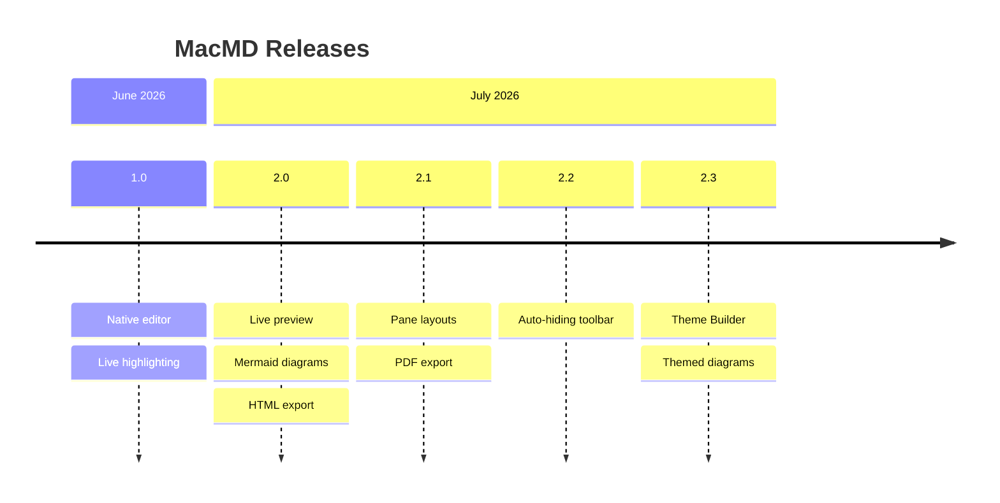

## Quadrant (`quadrantChart`)

Items plotted on two axes and sorted into four quadrants.

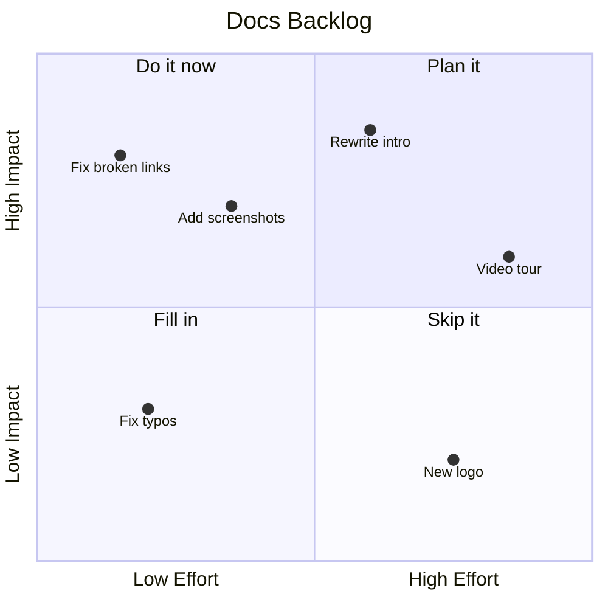
